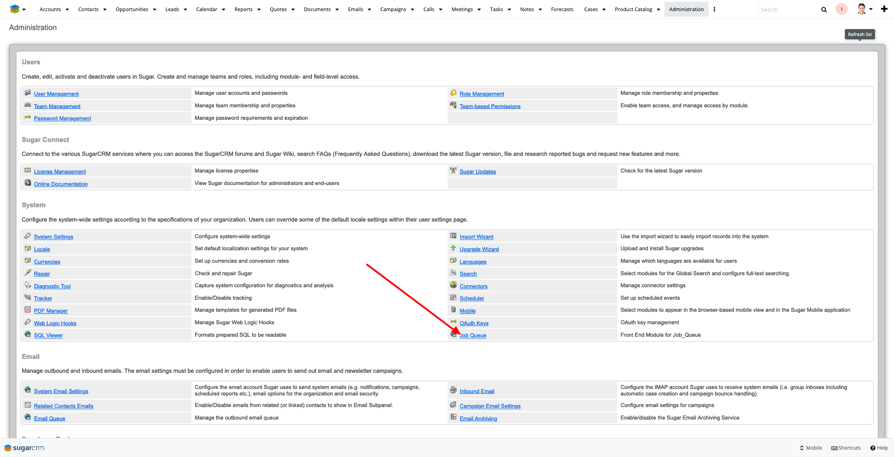
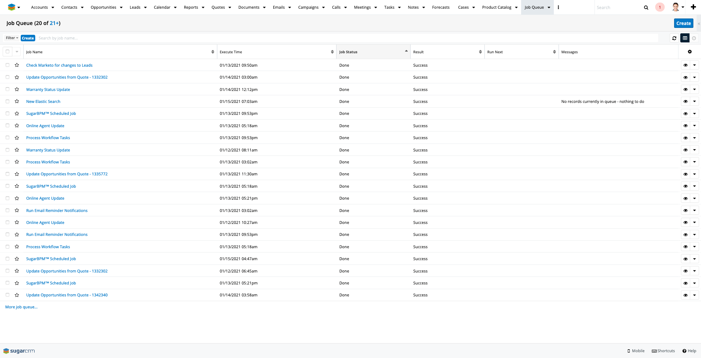
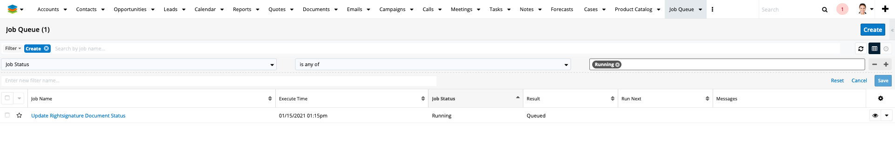
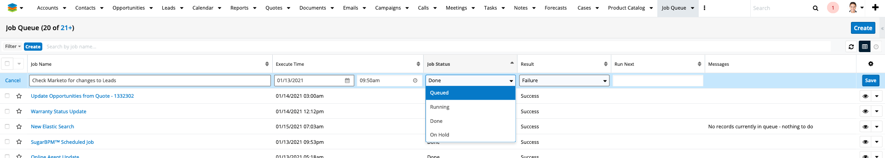

# job_queue

This module gives the job_queue table a nice Sugar Front End.
With this front end you can re-run jobs, cancel jobs and
just generally monitor scheduled jobs.

You will find the job_queue tool on your admin menu in the
'System' section

Once you click on that link you will be taken to the job_queue 
module.  There is no tab for this module so normal users 
will not have access to it.  This module shows you all
the relevant information about your scheduled jobs.

You can search for 'Running' jobs, 'Failed' jobs or as we do most of the 
time, 'Running AND Queued' jobs so we can just monitor its
progress when thats needed.

You can also rerun a job outside of its scheduled time by
setting both the Job Status and Result fields back to 'Queued'

